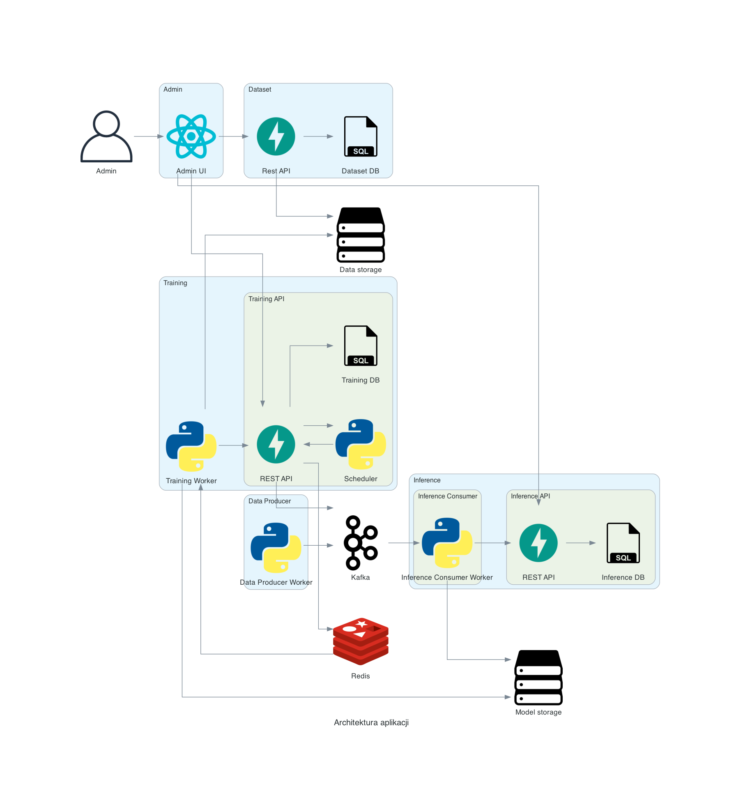

# Analiza danych strumieniowych z użyciem uczenia maszynowego

## Architektura

## Funkcjonalność

- CLI
  - konfiguracja harmonogramu trenowania
  - uruchamianie trenowania modelu na żądanie
  - dodawanie nowych zbiorów danych
- Zbiory danych
  - odczyt/zapis za pomocą REST API
  - możliwość pobrania najnowszego zbioru danych
- Harmonogram
  - możliwość konfiguracji za pomocą REST API 
  - uruchamianie trenowania wg konfiguracji
- Trenowanie
  - możliwość uruchomienia za pomocą REST API
  - zapis modelu w postaci binarnej na dysk
  - zapis metryk
- Metryki
  - możliwość wyświetlenia za pomocą UI
  - możliwość odczytu/zapisu za pomocą REST API